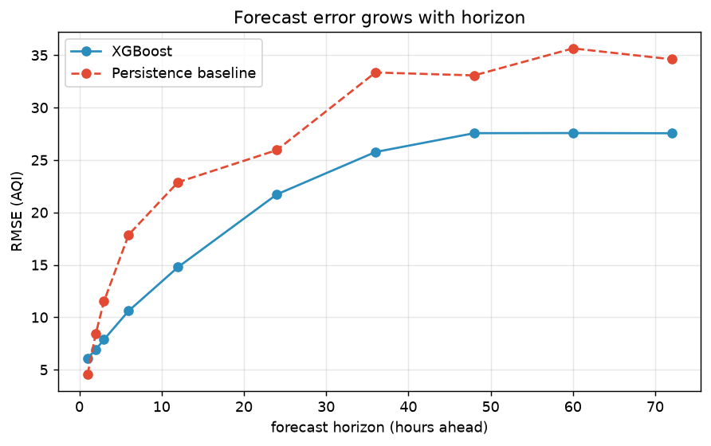
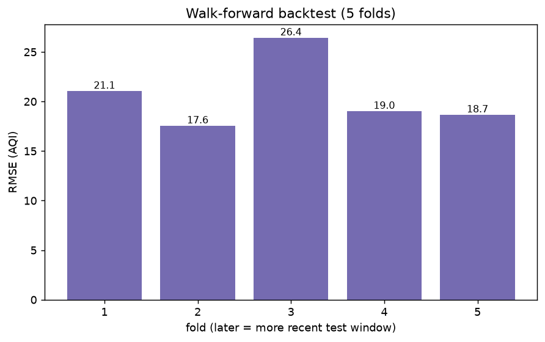

# Rigorous Evaluation — per-horizon & walk-forward

## Error by forecast horizon

How RMSE grows as we predict further ahead (vs the persistence baseline).

| Horizon (h) | RMSE | MAE | R² | Baseline RMSE |
|---:|---:|---:|---:|---:|
| 1.0 | 6.10 | 4.01 | 0.985 | 4.54 |
| 2.0 | 6.92 | 4.44 | 0.981 | 8.43 |
| 3.0 | 7.88 | 5.13 | 0.975 | 11.52 |
| 6.0 | 10.61 | 7.06 | 0.957 | 17.88 |
| 12.0 | 14.78 | 10.46 | 0.917 | 22.89 |
| 24.0 | 21.72 | 15.85 | 0.819 | 25.94 |
| 36.0 | 25.76 | 19.15 | 0.746 | 33.35 |
| 48.0 | 27.56 | 20.64 | 0.708 | 33.07 |
| 60.0 | 27.57 | 20.53 | 0.721 | 35.64 |
| 72.0 | 27.55 | 21.16 | 0.695 | 34.61 |

## Walk-forward backtest

Rolling-window validation — each fold trains on the past, tests on the next window.

| Fold | Train rows | Test rows | Test from | RMSE | MAE | R² |
|---:|---:|---:|---|---:|---:|---:|
| 1 | 33,335 | 33,333 | 2023-08-13 | 21.06 | 14.56 | 0.795 |
| 2 | 66,668 | 33,333 | 2024-03-22 | 17.56 | 12.39 | 0.734 |
| 3 | 100,001 | 33,333 | 2024-10-30 | 26.44 | 16.56 | 0.778 |
| 4 | 133,334 | 33,333 | 2025-06-07 | 19.03 | 12.58 | 0.847 |
| 5 | 166,667 | 33,333 | 2026-01-14 | 18.67 | 12.28 | 0.814 |

**Mean backtest RMSE: 20.55** (± 3.53)
